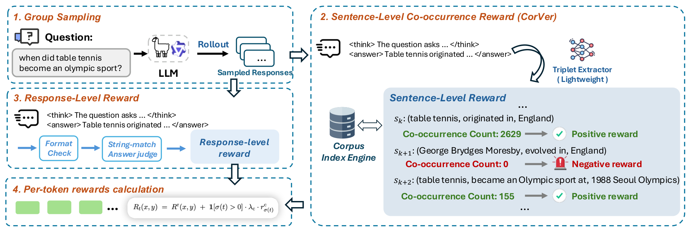

# CorVer

**Beyond Math and Code: Lightweight Corpus-Grounded Process Rewards for Factual Question Answering**

[Paper · arXiv](https://arxiv.org/abs/2605.29648) · [Training guide](docs/training.md) · [Baseline resources](#baseline-resources) · [MIT license](LICENSE)

CorVer assigns sentence-level factual rewards using a frozen 0.5B triplet extractor and a Wikipedia co-occurrence index. These rewards are aligned to generated tokens and combined with answer-correctness and format rewards for GRPO training. At inference time, only the trained policy is needed.



This repository contains the CorVer training implementation, configurations for six 3B–14B models, and the selected training questions.

For method details and experimental results, see the [paper on arXiv](https://arxiv.org/abs/2605.29648).

## Repository layout

```text
corver/                  Main method
  train.py               Training entry point
  configs/               Six model configurations
  rewards/               Corpus lookup, extractor, and sentence rewards
  training/              GRPO trainer, loss, and token alignment checks
common/                  Shared data/configuration helpers and answer protocol
data/                    Selected training questions
docs/                    Training guide, method figure, and third-party notices
tests/                   Reward, optimization, and configuration checks
```

Run the CorVer module commands below from the repository root.

## Model configurations

The base models below are the official instruction-tuned starting checkpoints. Each YAML pins its revision.

| Model | Official base model | Configuration |
|---|---|---|
| Llama-3.2-3B-Instruct | [meta-llama/Llama-3.2-3B-Instruct](https://huggingface.co/meta-llama/Llama-3.2-3B-Instruct) | [llama32_3b.yaml](corver/configs/llama32_3b.yaml) |
| Qwen3-4B | [Qwen/Qwen3-4B](https://huggingface.co/Qwen/Qwen3-4B) | [qwen3_4b.yaml](corver/configs/qwen3_4b.yaml) |
| Llama-3.1-8B-Instruct | [meta-llama/Llama-3.1-8B-Instruct](https://huggingface.co/meta-llama/Llama-3.1-8B-Instruct) | [llama31_8b.yaml](corver/configs/llama31_8b.yaml) |
| Qwen3-8B | [Qwen/Qwen3-8B](https://huggingface.co/Qwen/Qwen3-8B) | [qwen3_8b.yaml](corver/configs/qwen3_8b.yaml) |
| OLMo-2-1124-13B-Instruct | [allenai/OLMo-2-1124-13B-Instruct](https://huggingface.co/allenai/OLMo-2-1124-13B-Instruct) | [olmo2_13b.yaml](corver/configs/olmo2_13b.yaml) |
| Qwen3-14B | [Qwen/Qwen3-14B](https://huggingface.co/Qwen/Qwen3-14B) | [qwen3_14b.yaml](corver/configs/qwen3_14b.yaml) |

The 13B/14B configurations use microbatch 1 and gradient accumulation 48, with three questions and 16 completions per question.

## Quick start

Use Linux, Python 3.12, and a CUDA GPU. The experiments use a single H100 80GB. Accept the base model's access terms on Hugging Face when required.

```bash
python3.12 -m venv .venv
source .venv/bin/activate
pip install -r requirements.txt
hf auth login

hf download UIC-AI-lab/infigram-wikipedia-index --repo-type dataset \
  --revision eb79e36cec15d9738f5b39a0e3db911b8d0f7c1e \
  --local-dir ./infigram_index
export CORVER_INDEX_DIR="$PWD/infigram_index"

# Validate the configuration and data on CPU.
python -m corver.train --config corver/configs/llama32_3b.yaml --dry-run

# Full CorVer training; one visible GPU.
CUDA_VISIBLE_DEVICES=0 python -m corver.train \
  --config corver/configs/llama32_3b.yaml
```

Choose a YAML from the model table above; the same entry point accepts the 13B/14B configurations. Model, extractor, tokenizer, and index revisions are pinned in each configuration. Resource downloads use the standard Hugging Face cache.

Relative data and output paths resolve from the repository root. Use `--output` for a separate run, `--model-path` / `--extractor-path` for local resource copies, and `--resume` to continue a complete checkpoint. Resume checks the configuration and training-data hash. See [data notes](data/README.md) and [configuration details](docs/training.md).

## Development checks

```bash
python -m unittest discover -s tests -v
```

## Baseline resources

Public resources for the baselines compared in the paper:

| Method | Public resources |
|---|---|
| FSPO | [Official code](https://github.com/nusnlp/FSPO) |
| RLFH | [Official code](https://github.com/AlignRM/RLFH) |
| FoRAG | [Official models and datasets](https://huggingface.co/forag) |
| KnowRL | [Official code](https://github.com/zjunlp/KnowRL) |

The paper describes the experimental settings used in our comparisons.

## Acknowledgements

CorVer uses [Infini-gram](https://github.com/infini-gram/infini-gram), [QuCo-RAG](https://github.com/ZhishanQ/QuCo-RAG), [Unsloth](https://github.com/unslothai/unsloth), and [TRL](https://github.com/huggingface/trl). See [third-party notices](docs/third_party.md) for the retained parser license and model/data terms.
